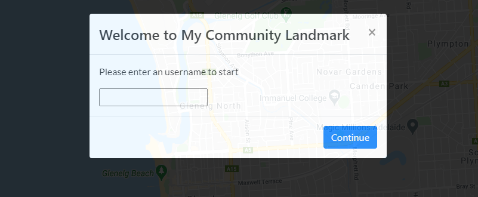
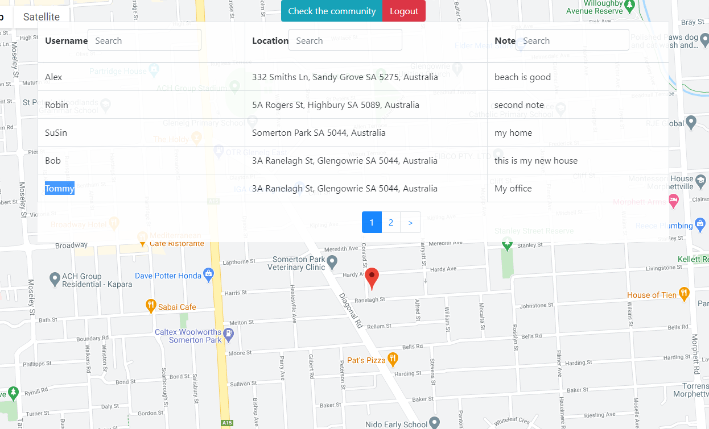

# My-Community-Landmark

A responsive web application that allows users to save location based notes on Google Maps. 

It enables an user to 
- see current location on the map
- save a short note at the current location
- see notes that saved at the location they were saved on the map
- see the location, text, and user-name of notes other users have saved
- search for a note based on contained text or user-name or address

## landing page

## view current location

## check community

## search

